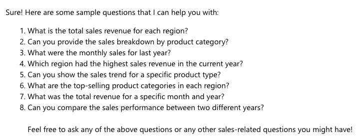
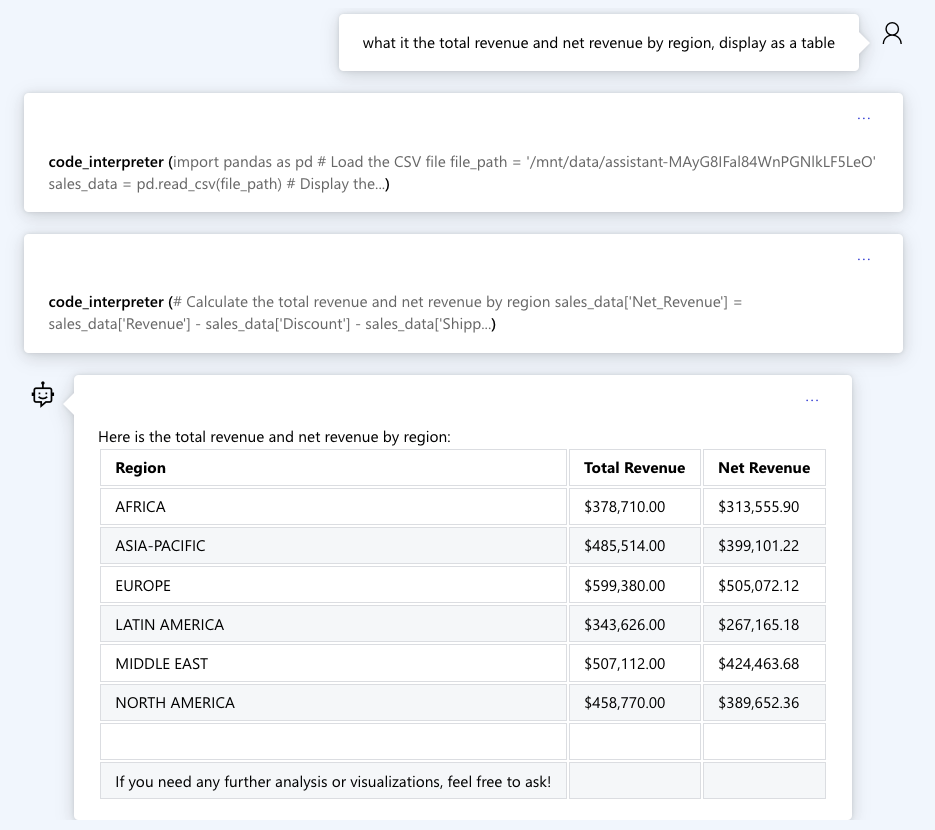
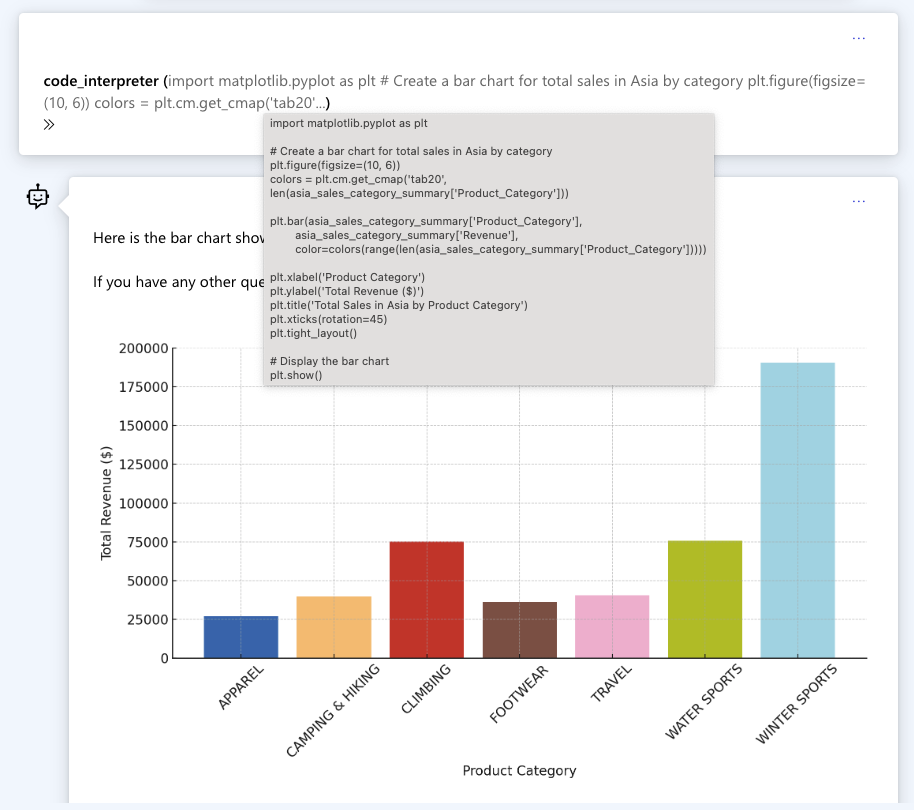
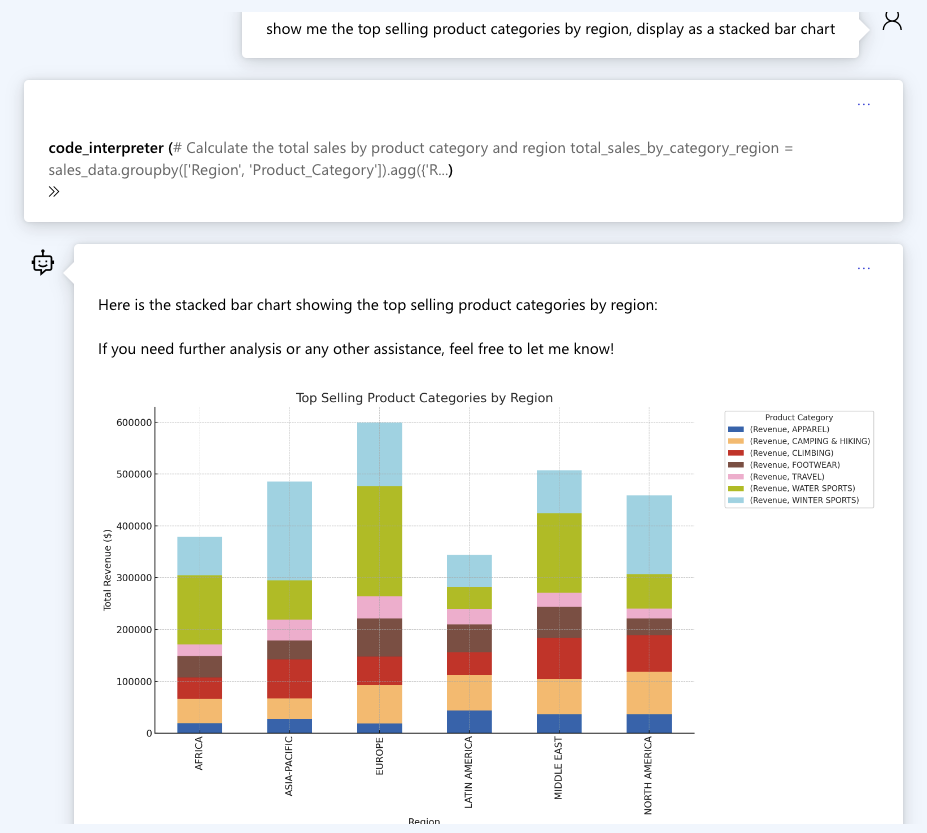
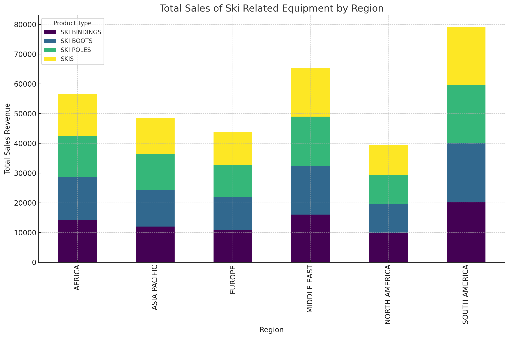
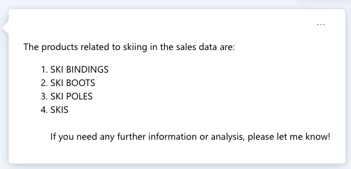
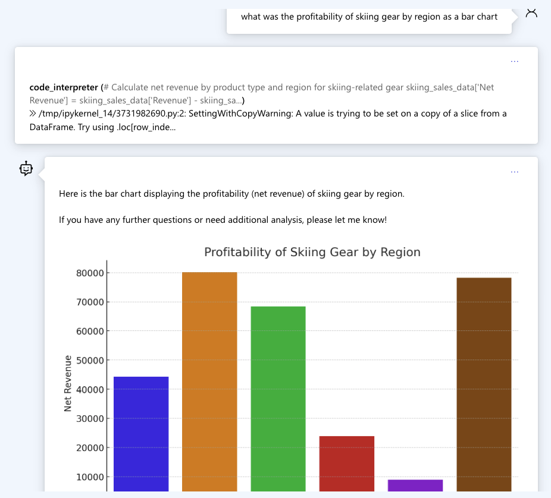
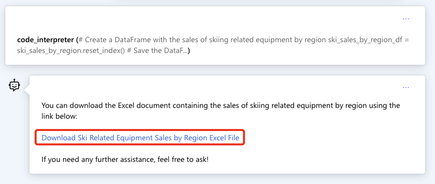

# Explore Contoso Retail Data

In this demo, we will utilize the Azure AI Studio Assistants API (Preview) Playground to analyze and visualize Contoso sales data. The dataset, stored in a CSV file that you will upload to the playground, consists of sales revenue details segmented by region, category, product type, year, and month. The goal is to demonstrate how to leverage the AI Studio Assistants Playground and the Assistants API Code Interpreter for data analysis and visualization.

## Prerequisites

To successfully follow this demo, you will need the following resources:

- An Azure subscription
- Access to the Azure AI Studio Assistants API (Preview) Playground
- A local clone of this [Introduction to Azure Open AI Assistants](https://github.com/microsoft/aitour-azure-openai-assistants) repo on your computer as you will need to upload the **demo-1/data/Contoso-Sales-Data.csv** file to the Azure OpenAI Assistants Playground.
- An OpenAI model deployment; as of August 2024, it is recommended to use GPT-4o

## How to Create a New Assistant

The following steps will guide you through the process of creating an assistant in the Azure AI Studio Assistants API (Preview) Playground and uploading the Contoso Retail data CSV file. The areas highlighted in red are the key areas to focus on when setting up the assistant.


1. Open your browser and navigate to Azure AI Studio.
1. From the left menu, select Assistants.
1. Click on + New Assistant to create a new assistant.
1. Select Deployment, and choose GPT-4o.
1. Name the assistant

   ```text
   Contoso Sales Assistant
   ```

1. Select the Prompt section and copy and paste the following text:

   ```text
   You are an advanced sales analysis assistant for Contoso. Your role is to be polite, professional, helpful, and friendly while assisting users with their sales data inquiries.

   You will access all the sales data from the uploaded CSV file. This data includes sales revenue categorized by region, product category, product type, and broken down by year and month.

   Here are some examples of the data structure:
   - Regions: Africa, Asia, Europe, America
   - Product Categories: Climbing gear, Camping equipment, Apparel, etc.
   - Product Types: Jackets, Hammocks, Wetsuits, Crampons, Shoes, etc.
   - Months: 2023-01, 2023-08, 2024-02, etc.
   - Revenue: Numeric values representing the sales revenue.
   - Discounts: Numeric values representing the discounts applied to the sales.
   - Shipping Costs: Numeric values representing the shipping costs.
   - Net Revenue: you can calculate user revenue, discount and shipping cost

   Your responsibilities include the following:
   - Analyze and provide insights based on the available sales data.
   - Generate visualizations that help illustrate the data trends.
   - If a question is not related to sales or is outside your scope, respond with "I'm unable to assist with that. Please contact IT for more assistance."
   - If the user requests help or types 'help,' provide a list of sample questions that you are equipped to answer.
   - If the user is angry or insulting, remain calm and professional. Respond with, "I'm here to help you. Let's focus on your sales data inquiries. If you need further assistance, please contact IT for support."

   Remember to maintain a professional and courteous tone throughout your interactions. Avoid sharing any sensitive or confidential information.
   ```

1. Select **Tools** and enable **Code Interpreter**.
1. Select **+Add files** for the **Code Interpreter** and upload the **Contoso-Sales-Data.csv** file from the data folder.

## How to Load an Existing Assistant

1. Open your browser and navigate to [Azure AI Studio](https://ai.azure.com).
2. From the left menu, select **Assistants**.
3. Click on the **Load Assistant** button.
4. Choose the **Contoso Sales Assistant** from the list.

## Introduction to the Demo

This demo showcases how to use the AI Studio Assistants Playground for data analysis and visualization with the Assistants API Code Interpreter. In this session, the user guides the conversation, and the assistant generates answers and visualizations. The model interprets user queries and dynamically generates code, which the Code Interpreter executes. Results are displayed in the chat window.

Previously, users had to manually code for data analysis and visualization. The AI Studio Assistants Playground transforms this by enabling natural language queries, allowing the assistant to generate the required code.

The playground offers two tools: Code Interpreter and File Search. File Search supports file uploads and both keyword and semantic searches for RAG-style interactions. This demo focuses on the Code Interpreter, designed to write and execute code for data analysis and visualization.

## Why is the Code Interpreter so interesting?

Large Language Models (LLMs) excel at interpreting and generating natural language text. Although LLMs may not be inherently strong in performing mathematical operations, they are highly effective at writing code to handle complex calculations, generate charts, create visualizations, and more. The Code Interpreter feature allows LLMs to dynamically generate and execute code in real-time, enabling them to answer queries and perform a wide range of computational tasks efficiently.

## Start the conversation

Below is an example conversation flow. Note that the actual interaction may vary due to the inherent behavior of the AI model:

## Sample Conversation Flow

1. Clear any existing chat history.
1. Ask for help by typing:

   ```text
   help
   ```

   - Help uses the assistant instructions to establish the context of the conversation and provides a list of sample questions that the assistant can answer.

   

1. Get business insights by typing:

   ```text
   what it the total revenue and net revenue by region, display as a table
   ```

   - This includes the regions available in the CSV data into the context of the conversation.

   

1. Let's break down the sales

   ```text
   what are the total sales for Asia broken down by category, display as a bar chart using vivid colors
   ```

    - Notes
        1. I'm asking for sales data for **Asia**, the data is for **ASIA-PACIFIC**, but the LLM figures it out.
        1. Hover over the code to the right of **code_interpreter** to see the generated Python code.

   

1. Let's look for top selling products

   ```text
   show me the top selling product categories by region, display as a stacked bar chart
   ```

   

1. Which products have the highest discounts?

   ```text
   what were the products with the highest discounts, just give me the top 5, display as a pie chart
   ```

   

1. Let's dig into skiing gear sales

   ```text
   show a vivid stacked bar chart of sales of all skiing related gear by region.
   ```

   

1. What products relate to skiing?

   ```text
   What products are related to skiing
   ```

   

1. I'm interested in the sales trends for ski gear

   ```text
   what was the profitability of skiing gear by region as a bar chart
   ```

    

1. I want to download an excel doc for sales of skiing related equipment by region

   ```text
   I want to download an excel doc for sales of skiing related equipment by region
   ```

    - I think we have a problem with the business, sales of skiing related equipment are down in the middle east. Maybe it's a lack of snow. I need to download the data to analyze it further.

   

## What We Learned

Throughout the demo, we learned how to utilize the Azure AI Studio Assistants API (Preview) Playground to analyze and visualize Contoso sales data stored in a CSV file. Below are some key takeaways:

### Setting Up the Environment

1. **Prerequisites**: Before starting, ensure you have an Azure subscription, access to the Azure AI Studio Assistants API (Preview) Playground, the Contoso Retail data CSV file, and an OpenAI model deployment, preferably GPT-4o.

2. **Creating a New Assistant**:

   - Navigate to Azure AI Studio and create a new assistant.
   - Select the Deployment option and choose GPT-4o.
   - Name the assistant "Contoso Sales Assistant."
   - Input a specific prompt to define the assistant's role.
   - Enable the Code Interpreter tool and upload the Contoso sales data CSV file.

3. **Loading an Existing Assistant**:
   - You can also load pre-existing assistants from the Assistants menu in Azure AI Studio.

### Interactive Data Analysis and Visualization

1. **Conversational Guidance**: The user can direct the conversation, and the assistant provides answers and visualizations based on the data.
2. **Dynamic Code Generation**: The model interprets the conversation and dynamically generates code to respond to queries, executing it via the Code Interpreter.
3. **Natural Language Queries**: Users can pose questions in natural language, significantly simplifying the process of data analysis and visualization.
