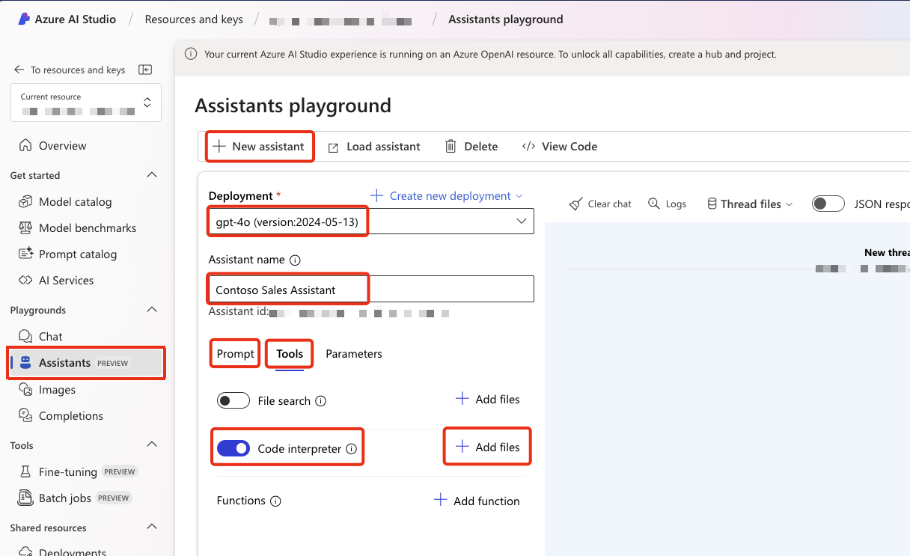

# Explore Contoso Retail Data

There are two demos for demo 1 in this session. The preferred demo is the first, but you own the session, so choose the demo that best suits your style.

1. [Contoso Sales Assistant built with Chainlit and the Azure OpenAI Assistants API](#contoso-sales-assistant-built-with-chainlit-and-the-azure-openai-assistants-api) (Preferred demo).
2. [Contoso Sales Assistant built with Azure AI Studio Assistants API (Preview) Playground](#contoso-sales-assistant-built-with-azure-ai-studio-assistants-api-preview-playground) (Backup demo).

## Why use the Azure OpenAI Assistants API?

The Azure OpenAI Assistants API makes it easier to build generative AI apps by simplifying key tasks:

1. Streamlined Development: It abstracts the complexities of integrating AI, allowing developers to focus on building features rather than managing the AI model.
2. Context Management: The API automatically handles conversation context, ensuring the AI provides relevant, coherent responses throughout interactions.
3. Scalability: It scales effortlessly, managing workloads and resources automatically to handle both small and large user bases.
4. Context Execution: The API lets you define and run context against an LLM, making it easier to perform tasks like data queries or code generation based on specific instructions.

Overall, the Azure OpenAI Assistants API simplifies generative AI development, managing context, scaling, and execution efficiently.

The app demonstrates the use of the 3 tools currently supported for the Assistance API

* [Function calling](https://learn.microsoft.com/azure/ai-services/openai/how-to/assistant-functions)
* [Code Interpreter](https://learn.microsoft.com/azure/ai-services/openai/how-to/code-interpreter)
* [File Search](https://learn.microsoft.com/azure/ai-services/openai/how-to/file-search)

## Contoso Sales Assistant built with Chainlit and the Azure OpenAI Assistants API

### Scenario

You are a sales manager at Contoso, a multinational retail company that sells outdoor equipment. You need to analyze sales data to find trends, understand customer preferences, and make informed business decisions. To help you, Contoso has developed a conversational assistant that can answer questions about your sales data.

### Resources

#### YouTube Video

First, watch the 5-minute demo on YouTube video. This will give you a good overview of the demo.

[](https://youtu.be/Q8pZ-YRUbF0?si=TI5-F09g7N142OB3)

#### The Contoso Tents Datasheet

The **contoso-tents-datasheet.pdf** file used in the demo is in the **datasheet** folder for **demo-1** of this repository.

### Background

The app is built using the [Azure OpenAI Assistants API](https://learn.microsoft.com/azure/ai-services/openai/concepts/assistants) and [Chainlit](https://docs.chainlit.io/), with the backend powered by the Azure OpenAI Assistants API and app is written in Python. It demonstrates best practices for creating a conversational agent with this API. To enhance performance, the app is fully asynchronous, uses the FastAPI framework, and streams all responses to users in real-time.

### The Contoso Sales Assistant Source Code

The demo source code is available in the [Contoso Sales Assistant built with the Azure OpenAI Assistant API and Chainlit](https://github.com/gloveboxes/contoso-sales-azure-openai-assistant) repository.

### How the demo works

The demo uses a SQLite Contoso Sales Database with 40,000 rows of synthetic data. When the app starts, it reads the schema, product categories, product types, and reporting years, then adds this info to the Azure OpenAI Assistants API instruction context.

With this setup, the Azure OpenAI GPT-4 LLM and Assistants API can answer questions about Contoso’s sales data, generate SQL queries, and run them on the read-only SQLite database using function calls. The LLM and Code Interpreter can also run Python code to create visualizations, such as pie charts and tables, and generate Excel files for users to download for further analysis.

_This solution can be easily adapted to support other scenarios, such as customer support, simply by changing the database and adjusting the Azure OpenAI Assistants API instructions to fit the new use case._

### Objections

A common concern with the demo scenario is security, particularly the risks of SQL injection or malicious attempts to drop the database. While these concerns are valid, they can be mitigated by setting the database to read-only mode. For SQLite, this involves configuring the database as read-only. For a Database Service, you would assign the application a read-only (Select) role. Additionally, running the application in a secure environment provides an extra layer of protection.

In enterprise scenarios, data is extracted and transformed from transactional systems into a read-only database or data warehouse. This approach ensures the data is secure, optimized for performance, and that the application has read-only access to the data.

### Demo Considerations

1. This is the demo script used in the video, but since the application is powered by a large language model (LLM), conversations will vary. **Be prepared to adapt based on the responses you receive.** Feel free to customize the script as needed; it serves as a guide rather than a strict rule. **However, be aware that some prompts may produce large amounts of data, which can be tedious for the audience as it streams to the assistant. To maintain engagement, it's best to use prompts that generate concise responses. The assistant instructions favour data aggregates to reduce data returned from the database.**

2. The chat window shows the LLM [Chain of Thought](https://en.wikipedia.org/wiki/Prompt_engineering#Chain-of-thought), this is enabled to help understand the context of the conversation. **You can show the SQL queries and results from the "Function Calling" tool, and the Python code generated by the "Code Interpreter" tool by clicking their associated dropdowns.** Note, there is an overhead to Chain of Thought" as the context needs to be streamed to the chat window. In production, you would turn "Chain of Thought" off.
3. The Code Interpreter performance execution times can vary a lot, this is dependent on the code complexity, location, and time of day, so be patient when waiting for the Python code to execute and have talking points ready to fill the time.

### The Demo Script

1. From your browser, navigate to the [Contoso Sales Assistant](https://aka.ms/contoso-sales-assistant) website.
2. Login with your GitHub account to get a demo key.
3. Follow the instructions for the event, copy your API Key and navigate API Assistant demo.

#### Set the Assistant UX to Light Mode

Suggest setting light mode as generally better for an audience.

1. From the top right, select user icon
1. Select Light Mode
1. Start with chat history closed

#### Start the conversation

There are prompt starters in the chat window. The user can select these to start the conversation.

1. Select **Help**.
   This will provide a list of sample questions that the assistant can answer. Remember, on startup, the assistant loaded the database schema, product categories, product types, and reporting years, so it has this context to work with when providing help.
2. Select **Help in \<Your Preferred Language>**. (e.g., Help in Dutch, Help in French, etc.). This will provide a list of sample questions that the assistant can answer in the selected language.
3. You can demo in your preferred language but be sure to test the language support first.
4. Select **Start new chart**.
5. Select the 2nd from left starter.
   * Create a vivid pie chart of sales by region.

   The LLM will generate a SQL query, next the LLM will call the **ask_database** function to execute the query and return the results. The LLM will then generate the Python code to create the pie chart.

6. Next, we'll ask about beginner-friendly tents. The sales database has limited knowledge of the products as the focus of the database is sales data, so the LLM will generate a **limited** response based on the data available.

   **What beginner-friendly tents does Contoso sell?**

7. Next, we'll going to upload a Contoso Tents Datasheet to the Assistants API. This will allow the assistant to provide more detailed information about the tents. The Assistants API will vectorize the PDF and store the data in the database and the LLM will be able to access the data using hybrid (semantic and keyword) queries.

   1. Drag and drop the **contoso-tents-datasheet.pdf** onto the Contoso Sales Assistant. The assistant will now have access to the tent data. The pdf is in the **datasheet** folder for **demo-1** of this repository.
   2. Add the prompt **What beginner-friendly tents does Contoso sell?**
   3. Add resubmit the question.

   Now the assistant has access to the tent data and can provide more detailed information.

8. Now, we're going to combine the data from the sales database and the tent datasheet to provide a more detailed analysis.

   Submit the following prompt: **Show sales of tents by region and include a brief description in the table about each tent.**

9. Finally, let's use the Assistants API and the code interpreter to generate a report on the sales of beginner-friendly tents in Excel format.

   Submit the following prompt: **Create an excel file**

   The LLM will generate the Python code to create the Excel file. You can download the file by selecting the download link and open in Excel.

### What We Learned

The Contoso Sales Assistant demo showcases how to use the Azure OpenAI Assistants API and Chainlit to build a conversational agent that can answer questions about sales data, generate SQL queries, execute them against a read-only database, and create visualizations and Excel files for users to download. Here are some key takeaways:

1. **Context Management**: The assistant uses the Azure OpenAI Assistants API to manage conversation context.
2. **Data Analysis**: The assistant can answer questions about sales data, generate SQL queries, and execute them against a read-only database.
3. **Visualizations**: The assistant along with the code interpreter can create visualizations like pie charts and tables to help users understand the data better.
4. **Excel Files**: The assistant can create Excel files, as well as other file types like PDFs and PowerPoint presentations, for users to download and analyze further.
5. **Security**: By making the database read-only and ensuring the application runs in a secure environment, you can mitigate security risks like SQL injection.
6. **Data Integration**: By combining data from multiple sources, like the sales database and the tent datasheet, the assistant can provide more detailed analysis and insights.
7. **Customization**: The assistant and the LLM supports multiple languages, providing a more inclusive experience for users.

## Contoso Sales Assistant built with Azure AI Studio Assistants API (Preview) Playground

This is a **backup demo** should you decide not to use the Chainlit demo. The Azure AI Studio Assistants API (Preview) Playground is a powerful tool for data analysis and visualization.

In this demo, we will utilize the Azure AI Studio Assistants API (Preview) Playground to analyze and visualize Contoso sales data. The dataset, stored in a CSV file that you will upload to the playground, consists of sales revenue details segmented by region, category, product type, year, and month. The goal is to demonstrate how to leverage the AI Studio Assistants Playground and the Assistants API Code Interpreter for data analysis and visualization.

## Prerequisites

To successfully follow this demo, you will need the following resources:

* An Azure subscription
* Access to the Azure AI Studio Assistants API (Preview) Playground
* A local clone of this [Introduction to Azure Open AI Assistants](https://github.com/microsoft/aitour-azure-openai-assistants) repo on your computer as you will need to upload the **demo-1/data/Contoso-Sales-Data.csv** file to the Azure OpenAI Assistants Playground.
* An OpenAI model deployment; as of August 2024, it is recommended to use GPT-4o

## How to Create a New Assistant

The following steps will guide you through the process of creating an assistant in the Azure AI Studio Assistants API (Preview) Playground and uploading the Contoso Retail data CSV file. The areas highlighted in red are the key areas to focus on when setting up the assistant.



1. Open your browser and navigate to Azure AI Studio.
1. From the left menu, select Assistants.
1. Click on + New Assistant to create a new assistant.
1. Select Deployment, and choose GPT-4o.
1. Name the assistant

   ```text
   Contoso Sales Assistant
   ```

1. Select the Prompt section and copy and paste the following text:

   ```text
   You are an advanced sales analysis assistant for Contoso. Your role is to be polite, professional, helpful, and friendly while assisting users with their sales data inquiries.

   You will access all the sales data from the uploaded CSV file. This data includes sales revenue categorized by region, product category, product type, and broken down by year and month.

   Here are some examples of the data structure:
   - Regions: Africa, Asia, Europe, America
   - Product Categories: Climbing gear, Camping equipment, Apparel, etc.
   - Product Types: Jackets, Hammocks, Wetsuits, Crampons, Shoes, etc.
   - Months: 2023-01, 2023-08, 2024-02, etc.
   - Revenue: Numeric values representing the sales revenue.
   - Discounts: Numeric values representing the discounts applied to the sales.
   - Shipping Costs: Numeric values representing the shipping costs.
   - Net Revenue: you can calculate user revenue, discount and shipping cost

   Your responsibilities include the following:
   - Analyze and provide insights based on the available sales data.
   - Generate visualizations that help illustrate the data trends.
   - If a question is not related to sales or is outside your scope, respond with "I'm unable to assist with that. Please contact IT for more assistance."
   - If the user requests help or types 'help,' provide a list of sample questions that you are equipped to answer.
   - If the user is angry or insulting, remain calm and professional. Respond with, "I'm here to help you. Let's focus on your sales data inquiries. If you need further assistance, please contact IT for support."

   Remember to maintain a professional and courteous tone throughout your interactions. Avoid sharing any sensitive or confidential information.
   ```

1. Select **Tools** and enable **Code Interpreter**.
1. Select **+Add files** for the **Code Interpreter** and upload the **Contoso-Sales-Data.csv** file from the data folder.

## How to Load an Existing Assistant

1. Open your browser and navigate to [Azure AI Studio](https://ai.azure.com).
2. From the left menu, select **Assistants**.
3. Click on the **Load Assistant** button.
4. Choose the **Contoso Sales Assistant** from the list.

## Introduction to the Demo

This demo showcases how to use the AI Studio Assistants Playground for data analysis and visualization with the Assistants API Code Interpreter. In this session, the user guides the conversation, and the assistant generates answers and visualizations. The model interprets user queries and dynamically generates code, which the Code Interpreter executes. Results are displayed in the chat window.

Previously, users had to manually code for data analysis and visualization. The AI Studio Assistants Playground transforms this by enabling natural language queries, allowing the assistant to generate the required code.

The playground offers two tools: Code Interpreter and File Search. File Search supports file uploads and both keyword and semantic searches for RAG-style interactions. This demo focuses on the Code Interpreter, designed to write and execute code for data analysis and visualization.

## Why is the Code Interpreter so interesting?

Large Language Models (LLMs) excel at interpreting and generating natural language text. Although LLMs may not be inherently strong in performing mathematical operations, they are highly effective at writing code to handle complex calculations, generate charts, create visualizations, and more. The Code Interpreter feature allows LLMs to dynamically generate and execute code in real-time, enabling them to answer queries and perform a wide range of computational tasks efficiently.

## Start the conversation

Below is an example conversation flow. Note that the actual interaction may vary due to the inherent behavior of the AI model:

## Sample Conversation Flow

1. Clear any existing chat history.
1. Ask for help by typing:

   ```text
   help
   ```

   * Help uses the assistant instructions to establish the context of the conversation and provides a list of sample questions that the assistant can answer.

   

1. Get business insights by typing:

   ```text
   what it the total revenue and net revenue by region, display as a table
   ```

   * This includes the regions available in the CSV data into the context of the conversation.

   

1. Let's break down the sales

   ```text
   what are the total sales for Asia broken down by category, display as a bar chart using vivid colors
   ```

    * Notes
        1. I'm asking for sales data for **Asia**, the data is for **ASIA-PACIFIC**, but the LLM figures it out.
        1. Hover over the code to the right of **code_interpreter** to see the generated Python code.

   

1. Let's look for top selling products

   ```text
   show me the top selling product categories by region, display as a stacked bar chart
   ```

   

1. Which products have the highest discounts?

   ```text
   what were the products with the highest discounts, just give me the top 5, display as a pie chart
   ```

   

1. Let's dig into skiing gear sales

   ```text
   show a vivid stacked bar chart of sales of all skiing related gear by region.
   ```

   

1. What products relate to skiing?

   ```text
   What products are related to skiing
   ```

   

1. I'm interested in the sales trends for ski gear

   ```text
   what was the profitability of skiing gear by region as a bar chart
   ```

    

1. I want to download an excel doc for sales of skiing related equipment by region

   ```text
   I want to download an excel doc for sales of skiing related equipment by region
   ```

    * I think we have a problem with the business, sales of skiing related equipment are down in the middle east. Maybe it's a lack of snow. I need to download the data to analyze it further.

   

## What We Learned

Throughout the demo, we learned how to utilize the Azure AI Studio Assistants API (Preview) Playground to analyze and visualize Contoso sales data stored in a CSV file. Below are some key takeaways:

### Setting Up the Environment

1. **Prerequisites**: Before starting, ensure you have an Azure subscription, access to the Azure AI Studio Assistants API (Preview) Playground, the Contoso Retail data CSV file, and an OpenAI model deployment, preferably GPT-4o.

2. **Creating a New Assistant**:

   * Navigate to Azure AI Studio and create a new assistant.
   * Select the Deployment option and choose GPT-4o.
   * Name the assistant "Contoso Sales Assistant."
   * Input a specific prompt to define the assistant's role.
   * Enable the Code Interpreter tool and upload the Contoso sales data CSV file.

3. **Loading an Existing Assistant**:
   * You can also load pre-existing assistants from the Assistants menu in Azure AI Studio.

### Interactive Data Analysis and Visualization

1. **Conversational Guidance**: The user can direct the conversation, and the assistant provides answers and visualizations based on the data.
2. **Dynamic Code Generation**: The model interprets the conversation and dynamically generates code to respond to queries, executing it via the Code Interpreter.
3. **Natural Language Queries**: Users can pose questions in natural language, significantly simplifying the process of data analysis and visualization.
