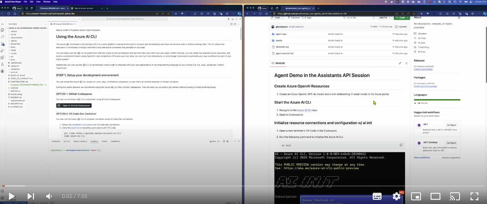
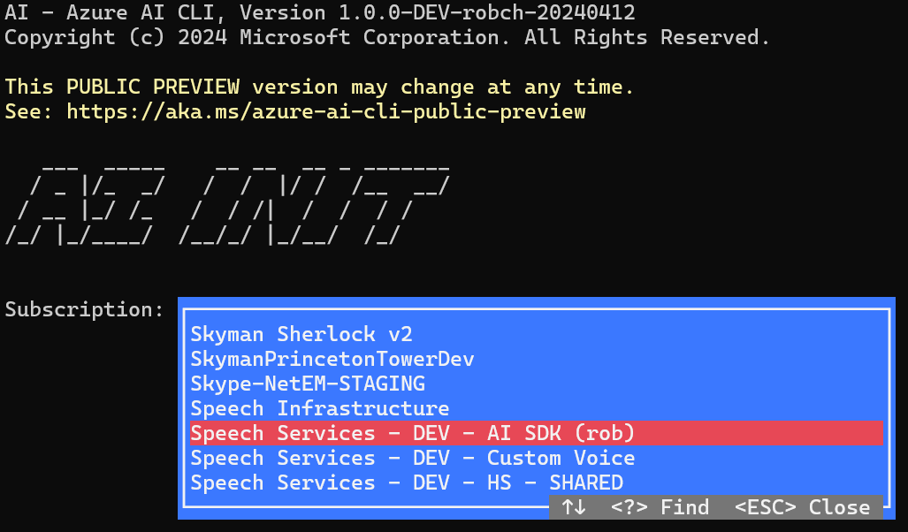

# Agent Demo in the Assistants API Session

This demo is optional depending on the time available in the session. It is a more advanced demo that shows how to create an agent app that uses the Assistants API to simulate a conversation between two personas.

The demo uses the [Azure AI CLI](https://github.com/Azure/azure-ai-cli), an open source project to kickstart the development of AI applications using Azure AI services.

## Video introduction

Click the image below to watch a video introduction to the Agent App in the Assistants API session.

[](https://youtu.be/dGT7cThhnSY)

## Create Azure OpenAI Resources

1. Create an Azure OpenAI GPT-4o model and a text-embedding-3-small model in the Azure portal.

## Start the Azure AI CLI

1. Navigate to the [Azure AI CLI](https://github.com/Azure/azure-ai-cli) repo
2. Open in Codespaces

## Initialize resource connections and configuration w/ ai init

1. Open a new terminal in VS Code in the Codespace.
2. Run the following command to initialize the Azure AI CLI:

    ```shell
    ai init
    ```



## Create the Agent App

1. Create the agent app with the following command:

    ```shell
    ai dev new sk-chat-with-agents
    ```

2. Change to the Agent folder:

    ```shell
    cd sk-chat-with-agents
    ```

3. Start CS Code

    ```shell
    code .
    ```

4. You'll be prompted to install the C# Dev Kit Extension. Click "Install".

## Explain the Agent App Personas

**Demo Tip: Set the VS Code terminal font size to a larger size for better visibility.**

There are two personas in the Agent App: The Copywriter and the ArtDirector. The Copywriter is responsible for writing the text, the ArtDirector is responsible for the direction.

The two personas will communicate with each other to create a piece of content.

The Copywriter persona is

```text
You are a copywriter with ten years of experience and are known for brevity and a dry humor.
The goal is to refine and decide on the single best copy as an expert in the field.
Only provide a single proposal per response.
You're laser focused on the goal at hand.
Don't waste time with chit chat.
Consider suggestions when refining an idea.
```

The ArtDirector persona is

```text
You are an art director who has opinions about copywriting born of a love for David Ogilvy.
The goal is to determine if the given copy is acceptable to print.
If so, state that it is approved.
If not, provide insight on how to refine suggested copy without example.
```

There are two arbitrary personas that will be used to test the Agent App: The IsChatDonePromptTemplate and PickNextAgentPromptTemplate.

The IsChatDonePromptTemplate persona is

```text
Determine if the copy has been approved.  If so, respond with a single word: yes

History:
{{$history}}
```

The PickNextAgentPromptTemplate persona is

```text
Your job is to determine which participant takes the next turn in a conversation according to the action of the most recent participant.
State only the name of the participant to take the next turn.

Choose only from these participants:
- {{{ReviewerName}}}
- {{{WriterName}}}

Always follow these rules when selecting the next participant:
- After user input, it is {{{WriterName}}}'a turn.
- After {{{WriterName}}} replies, it is {{{ReviewerName}}}'s turn.
- After {{{ReviewerName}}} provides feedback, it is {{{WriterName}}}'s turn.

History:
{{$history}}
```

## Run the Agent

From the VS Code terminal, run the following command:

1. Increase the font size in the terminal by pressing `Ctrl/Cmd +` a few times.

1. Export the Azure AI CLI config

    From the VS Code terminal, run the following command:

    ```shell
    ai dev shell
    ```

1. Run the Agent

    ```shell
    dotnet run
    ```

1. You'll be prompted for a user message. Enter a message and press Enter.

    ```text
    contoso sells good tents for beginners and adventurers
    ```

1. Now talk through the output with the personas.

   1. Hightlight the Copywriter persona's response.
   2. Highlight the ArtDirector persona's response.
